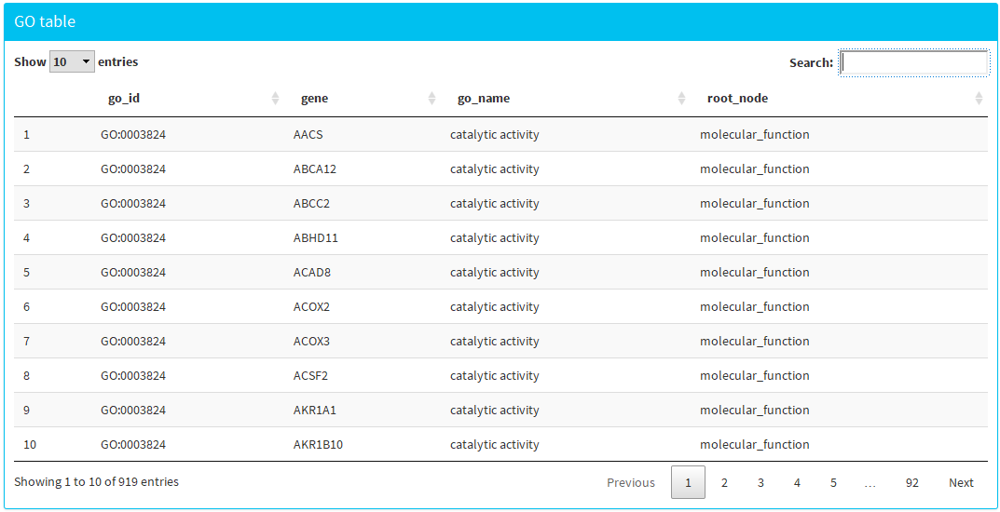

```{r setup, include=FALSE}
knitr::opts_chunk$set(echo = TRUE)
```

## Help

This App requires a set of data to generate the microarrays post analysis explained below. It has to contain the top Table resulting of a microarrays study, and the Expression Matrix obtained in the same way, both with only numerical data.


## Steps


  1. **Upload your files**: Load your data file of interest in .csv format, knowing in advance how the values and decimal numbers are separated. You can easily change how the web tool reads the separation of the values between tab, comma and semicolon, and how it reads the decimal numbers between point and comma. 
  

{width=300}

Download [Data](data/ExpressAndTop_AvsB.csv2) to see examples files.
     
   + **Top Table &  Expression Matrix**: The input file contains both top Table and Expression matrix. Here 
   you can see the data of the table in order to check if the file has been loaded correctly.
    
      {width=600}
 
 
       

+ **Tables**: This sections shows the top Table and the Expression Matrix table separately.

{width=500}
 
 
{width=500}


 2. **Do the selected genes from top Table**:
  
      + **Filter the top Table by AdjPValue and logFC**: This section allows you to choose what genes are differentially expressed according the Adjusted p-value and the logFC. For example, you can decide that genes differentially expressed will be those that have and Adjusted p-value < 0.05 and logFC > 1.
      
      {width=300}
      
      
  + **Table resulting of the filtering**: This section allows you to see the resulting table after the filters are applied.
  
    {width=300}
 
 3. **Volcano plot**:
 
     + **Visualize Volcano**: This section shows the volcano Plot from the top Table, resulting of plotting logFC in the x axis and -log(p-vavue) in the y axis. Filters applied previously by Adjusted p-value and logFC will show in the plot with different colours. 
     
     {width=500}

 4. **Heatmap**:
 
 + **Choose colours for plot**: This web tool allows the selection of custom colours for the heatmap, the grade of the first colour representing lower values and the grade of the second colour representing higher values.
 
 {width=300}
 
 + **Select breaks**: Changing the number of colour breaks affects the number of shades of colour presents in the expression data plot.
 
 {width=300}
 
 + **Visualize heatmap**: This section shows the heatmap from the Expression Matrix. Only the genes selected previously  by filters will be plotted. 
 
 {width=400}
 
 5. **GO analysis**:

 + **GO table**: This section shows the resulting table of the study of the Gene Ontology.
 
 {width=500}
 
 
 + **GO plot**: This section shows the resulting plot of the study of the Gene Ontology.
  
  {width=400}
      